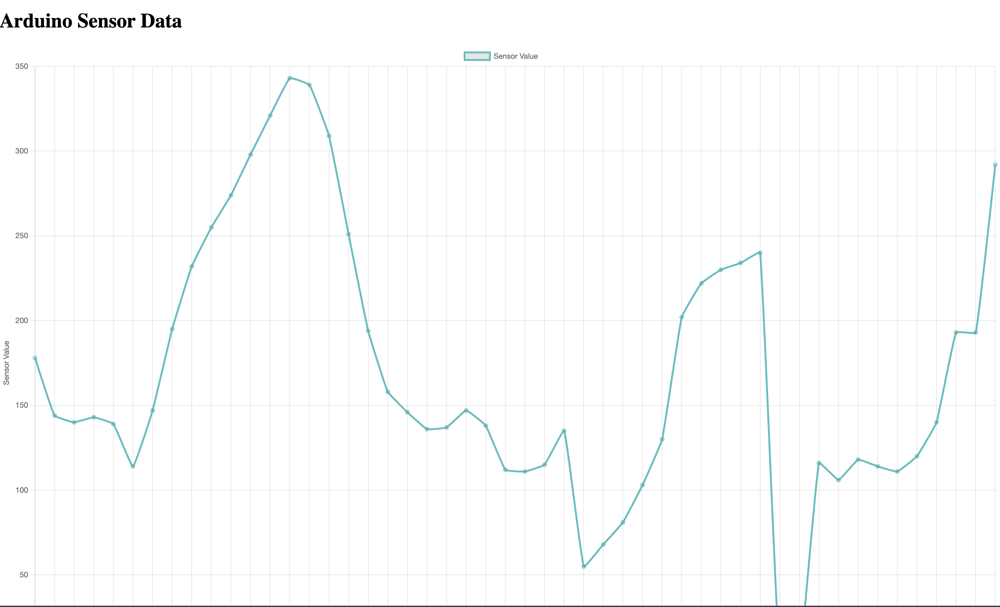

# waam_dashboard

Arduino and Raspberry Pi are connected via a USB cable.

It currently shows the dummy date from Arduino.

BUG: After receiving about 50(?) data, the plotting stops. The cause needs to be identified.

